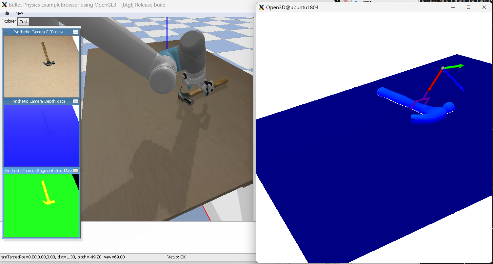

## Emboided Grasping In One

依赖：
```
torch==2.1.0
pybullet
open3d
transforms3d==0.4.2
ultralytics==8.2.32
numpy==1.24.4
flask
opencv-python
grasp_nms
```

### 安装
首先安装GraspNet 1B需要的KNN、Pointnet2:
```
cd libs/knn
python setup.py install
cd libs/pointnet2
python setup.py install
```

### 抓取模块
6D抓取姿态生成采用GraspNet 1B，输入是点云，输出带有Score的多个抓取姿态




执行一下脚本将检测服务启动：
```
cd yolo_world
python yolo_world.py
```

完整运行：
先启动yolo_world服务：
```
cd yolo_world
python yolo_world.py
```
再开一个新终端
```
python demo_graspnet2.py
```


